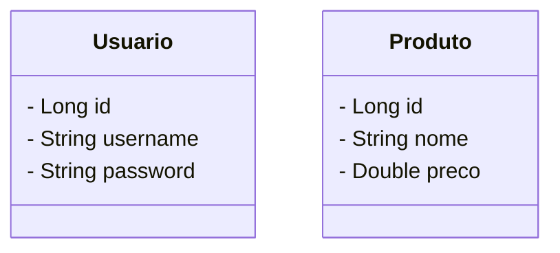

# Sistema de Gerenciamento de Pedidos  
@MateusAntony — Projeto Pessoal

API desenvolvida com Spring Boot, focada no gerenciamento de produtos com autenticação via JWT. O projeto foi construído seguindo boas práticas REST, segurança com Spring Security, persistência com JPA e uma arquitetura organizada em camadas.
Neste sistema:
- Usuários podem se autenticar e obter um token JWT para acessar endpoints protegidos.
- Produtos podem ser criados, atualizados, listados e removidos.
- Apenas usuários autenticados podem manipular dados.
- Exceções são tratadas de forma centralizada, garantindo respostas consistentes.


## Diagrama de Entidades

O projeto implementa um modelo relacional com os seguintes relacionamentos principais:




## Tecnologias

- Java  
- Spring Boot  
- Spring MVC  
- Spring Data JPA  
- JWT (JSON Web Token)
- Spring Security


## Práticas Adotadas

- Princípios SOLID  
- API RESTful
- Injeção de dependência com Spring  
- Segurança com JWT 
- Arquitetura em camadas (Controller, Service, Repository, Model)


## API Endpoints

Para fazer as requisições HTTP abaixo, foi utilizada a ferramenta Postman.

### Autenticação
  
`POST - /auth/login`
```json
{
  "username": "admin",
  "password": "123456"
}
```
Retorna um token JWT para autenticação.

### Listar Produtos

`GET - /produtos`
Necessita Token JWT no header

### Criar Produto

`POST - /produtos`
```json
{
  "nome": "Notebook",
  "preco": 3500.00
}
```

### Atualizar Produto

`PUT -/produtos/{id}`

```json
{
  "nome": "Notebook Atualizado",
  "preco": 3600.00
}
```

## Como Executar

### Clonar o repositório:

bash
git clone git clone https://github.com/MateusAntony/api-produtos.git
./mvnw spring-boot:run
